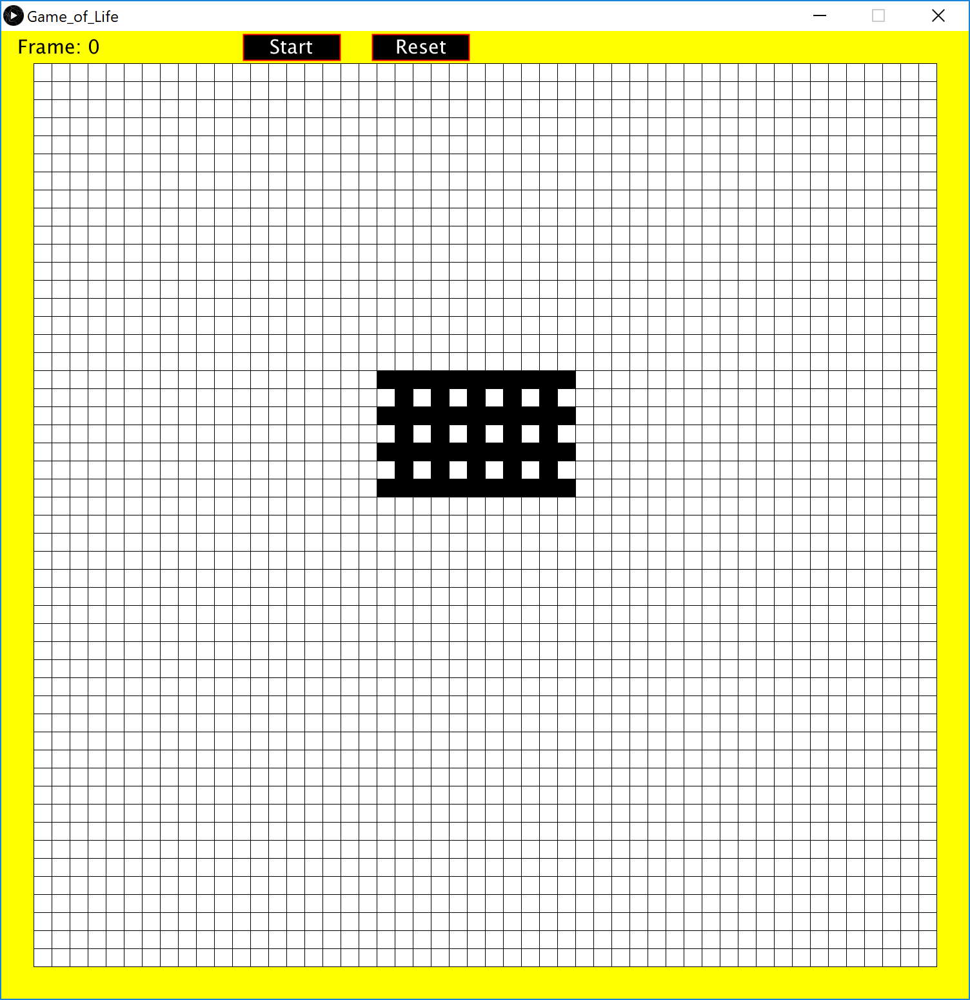

# Conways-Game-of-Life
Simple Implementation of [Conway's Game of Life](https://en.wikipedia.org/wiki/Conway%27s_Game_of_Life) by British mathematician [John Horton Conway](https://en.wikipedia.org/wiki/John_Horton_Conway) in 1970 using processing. It is meant as a simulation of evolution through cellular automaton, where the state of each cell is dependent only on its neighbouring cells.

## Requirements

* Processing

## Installing

Simply open "Game_of_Life.pde" in the "Game_of_life" folder through Processing and run.

## Instructions

There are two possible states for each cell, alive or dead. You can adjust the initial state by clicking on said cell. To start the simulation, click the "start" button at the top. To reset the simulation, click the "reset" button at the top. There's also a frame count on the top left corner, you can adjust the frames per second by changing the variable called "blinksPerSecond" in the code. 

## Rules

Like mentioned before, each cell is only dependent on its neighbouring cells, and that each cell has two possible states, alive or dead. every generation follows the rules listed below,
1. Any live cell with fewer than two live neighbors dies, as if by underpopulation.
2. Any live cell with two or three live neighbors lives on to the next generation.
3. Any live cell with more than three live neighbors dies, as if by overpopulation.
4. Any dead cell with exactly three live neighbors becomes a live cell, as if by reproduction.

## Screenshots

## Built With

* Processing

## Author(s)

* Bob Huang
